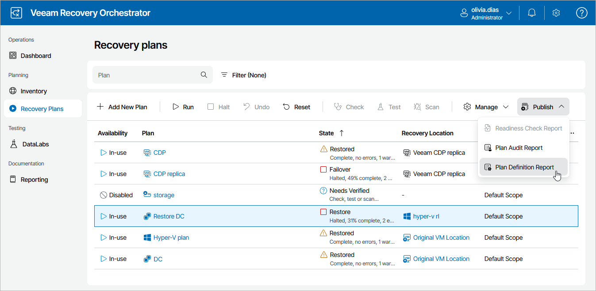
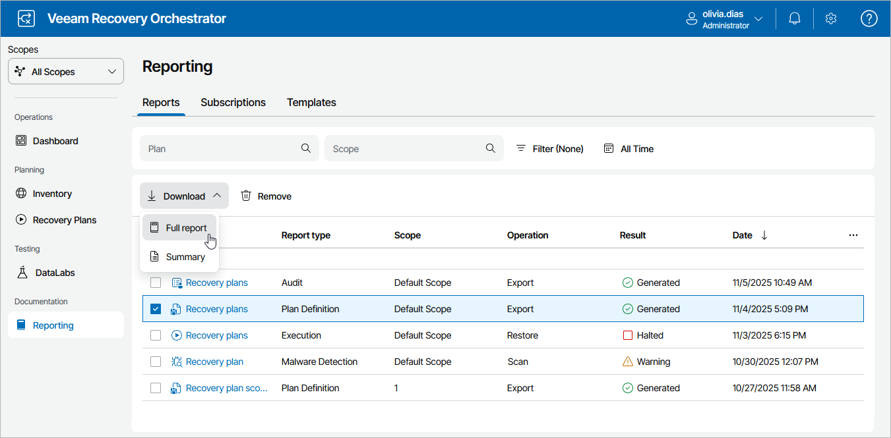
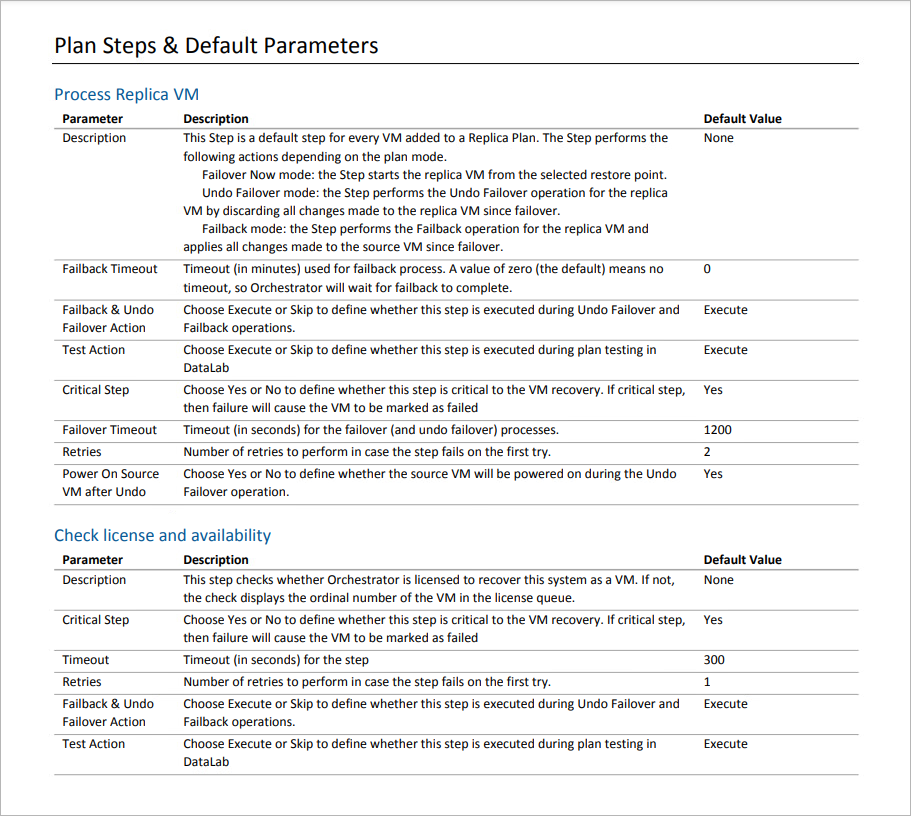

# Generating Plan Definition Report

As soon as you create a recovery plan, you will be able to generate the Plan Definition Report. The report provides an easily shareable view of all inventory groups, as well as steps and parameters defined by the plan.

This document is ideal for auditors and managers, and can be used to obtain a sign-off from application owners who need to verify plan configuration.

Orchestrator generates two types of reports:

* A summary report that includes a plan overview and a summary of inventory groups included in the plan with drill-down hyperlinks to individual machines.
* A full report that also includes details on the recovery location specified for the plan, information on specific steps that will run during the recovery process and the plan change log, which allows you to track who changed plan settings, when and what was changed.

Updating Definition Reports

By default, Orchestrator runs the Plan Definition Report automatically for every ENABLED recovery plan daily. You can also generate the report for a plan on demand:

1. Navigate to Recovery Plans.
2. Select the plan.
3. From the Publish menu, select Plan Definition Report.

-OR-

Right-click the plan and select Plan Definition Report from the drop-down menu.

|  |
| --- |
| Note |
| The Plan Definition Report link will be unavailable in case the plan is being edited. |

Downloading Plan Definition Reports

To access the report for a recovery plan:

1. Navigate to Reporting.
2. Select the report.
3. Click the plan name to download a summary report.

-OR-

Click Download and choose whether you want to download a summary or full report.

The Plan Definition Report will use the default report template or a [custom template](managing_templates.md). The plan definition will be appended at the end of the template.

