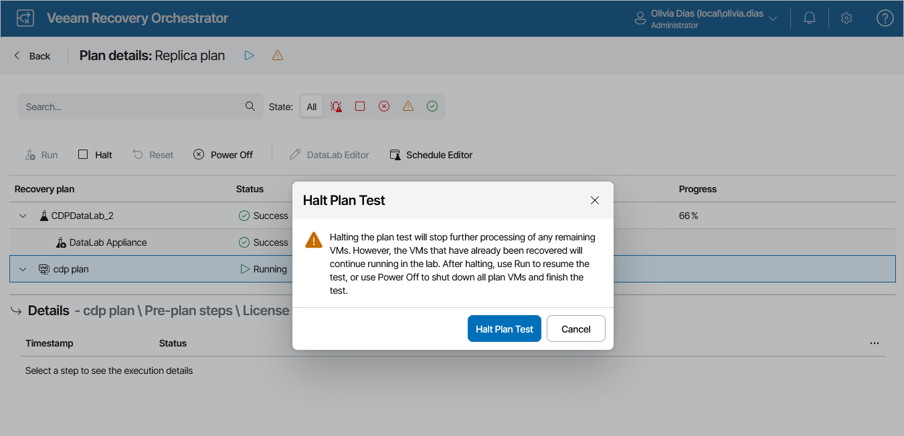
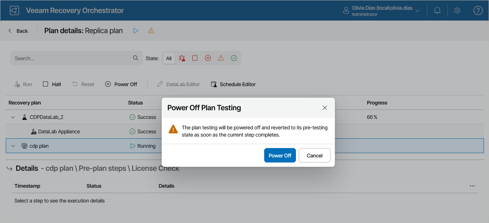

# Halting Plan Testing

The Halt action interrupts plan testing. You may need to halt plan testing, for example, if you need to fix some environment-related issues and then [proceed with testing later](resuming_restore_plan_testing.md) (in this case, recovered VMs will still continue to run). Or you may need to stop the testing process completely, for example, if you no longer need to test the selected restore plan (in this case, recovered VMs will be deleted).

To halt testing of a restore plan:

1. Navigate to Recovery Plans.
2. Click the plan name to switch to the Plan Details page.
3. On the Plan Details page, select the plan and click Halt.
4. In the Halt Plan Test window, click Halt Plan Test to confirm the action.

To cancel testing of a restore plan:

1. Navigate to Recovery Plans.
2. Click the plan name to switch to the Plan Details page.
3. On the Plan Details page, select the plan and click Power Off.
4. In the Power Off Plan Testing window, click Power Off to confirm the action.

