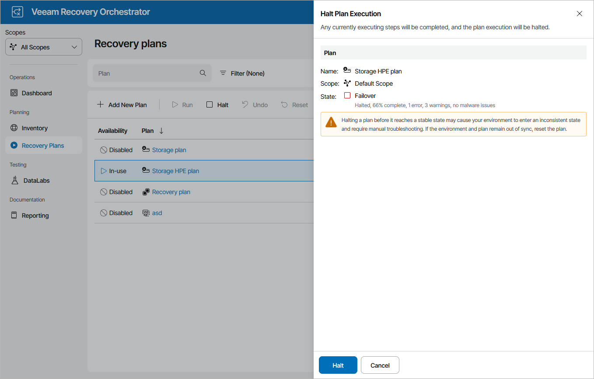

# Halting Storage Failover

The Halt action interrupts plan execution. Any steps currently executing will be completed, then the plan will enter the HALTED state. To learn how to work with HALTED storage plans, see [Managing Halted Plans](managing_halted_storage_plans.md).

To stop a running storage plan:

1. Navigate to Recovery Plans.
2. Select the plan and click Halt.
3. In the Halt Plan Execution window, do the following:

1. For security purposes, retype your password and click Next.
2. Review configuration information and click Halt.

