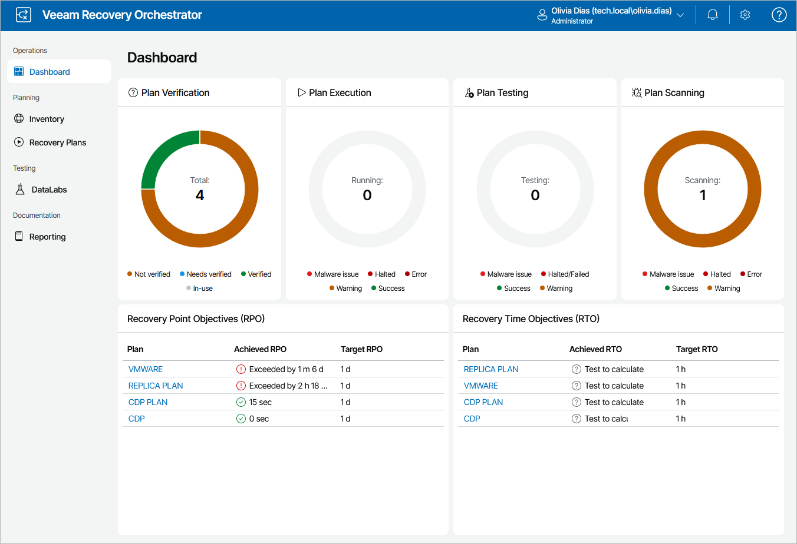

# Home Page Dashboard

The dashboard on the home page of the Orchestrator UI provides an overview of all recovery plans for the selected scope:

* The Plan Verification chart shows the number of:

* Failed checks
* Checks completed successfully
* Plans not checked yet

The worst state of a plan readiness check is Not verified. It means that the plan is not in the ready-to-run state.

* The Plan Execution chart shows the number of:

* Halted plans
* Plans completed successfully
* Plans completed with warnings
* Plans completed with errors

* Plans completed with malware issues

The worst state of a plan execution is Halted. It means that the plan has stopped processing because of a critical error for a machine from a critical inventory group in the plan.

* The Plan Testing chart shows the number of:

* Failed and halted plan tests
* Plan tests completed successfully
* Plan tests completed with warnings
* Plan tests completed with errors
* Plan tests completed with malware issues

The worst state of a plan testing is Failed. It means that the test has stopped because of a critical error for a machine from a critical inventory group in the lab.

* The Plan Scanning chart shows the number of:

* Halted plan scans
* Plan scans completed successfully
* Plan scans completed with warnings
* Plan scans completed with errors
* Plan scans completed with malware issues

The worst state of a plan scanning is Malware issue. It means that the scan has stopped because an infected restore point was detected on a machine included the plan.

* The Recovery Point Objectives (RPO) and Recovery Time Objectives (RTO) panes show recovery plans with the RPO and RTO, allowing you to track the achieved objectives versus targets for 10 plans to ensure you are meeting business service level agreements (SLAs).

To switch to the Plan Details page and see the list of issues that occurred while performing plan steps for a plan, click the plan name in the Plan column.

