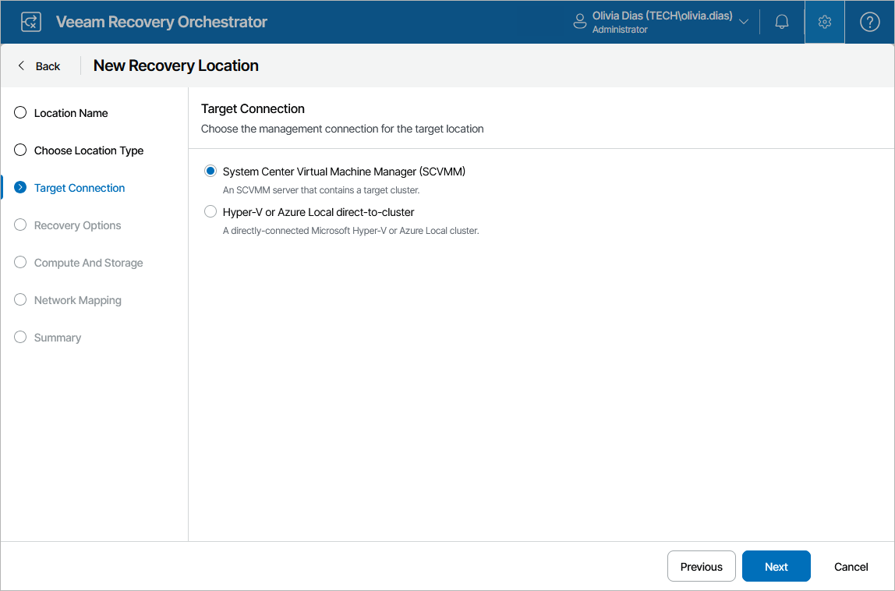

# Step 3. Specify Connection Type

At the Target Connection step of the wizard, choose whether you want to use an SCVMM connection or a direct connection to a standalone Microsoft Hyper-V or Azure Local cluster to restore machines to this recovery location.

