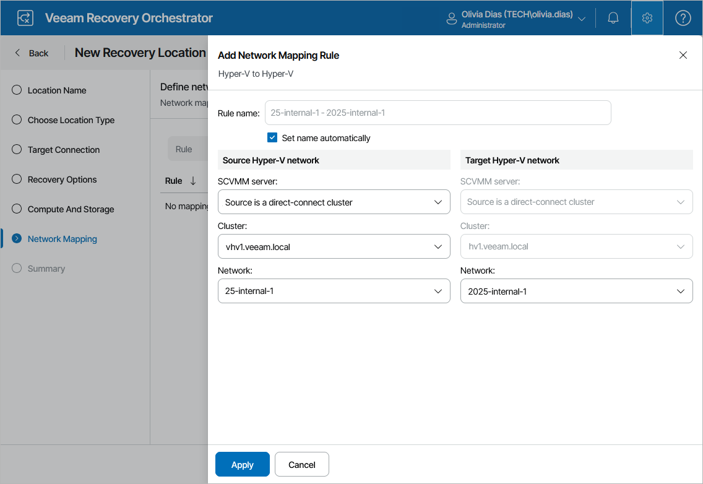

# Step 6. Configure Network Mapping

When you recover a VM from a Hyper-V backup, the recovered VM is connected to the same Hyper-V networks as the source VM; if the same networks are not available in the recovery location, you can create a network mapping table for the location so that the recovered VM is connected to the correct network. However, when you recover a VM from a vSphere backup, there are no Hyper-V networks that can be used. Therefore, to recover a vSphere VM, you must create at least one network mapping rule so that the recovered VM is connected to the correct network.

To configure network mapping, at the Network Mapping step of the wizard, click Add > VMware Mapping to recover VMs from vSphere backups or Add > Hyper-V Mapping to recover VMs from Hyper-V backups. Then, do the following in the Add Network Mapping Rule window:

1. In the Source network section, select a vCenter Server or an SCVMM server that manages source VMs, a network to which the source VMs are connected, and a datacenter or a cluster where the source VMs reside.

For a vCenter Server to be displayed in the vCenter server list, it must be connected to Orchestrator as described in section [Connecting VMware vSphere Servers](connecting_vsphere_servers.md). For an SCVMM server to be displayed in the SCVMM server list, it must be connected to Orchestrator as described in section [Connecting Microsoft Hyper-V Servers](connecting_scvmm_servers.md).

1. In the Target Hyper-V network section, select a network to which the recovered VMs will be connected.

For a network to be displayed in the Network list, it must be configured on all the hosts of the cluster selected at [step 5](hyperv_location_server.md) of the wizard. For more information on how to configure network for Hyper-V hosts, see [Microsoft Docs](https://learn.microsoft.com/en-us/system-center/vmm/hyper-v-network?view=sc-vmm-2025).

