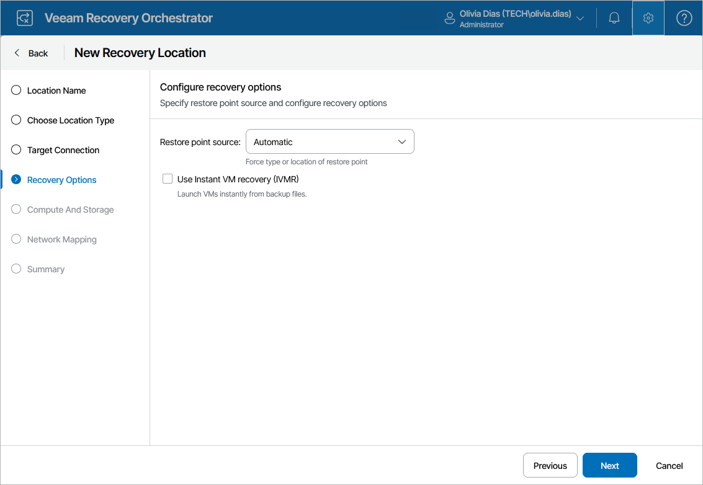

# Step 4. Choose Recovery Options

At the Recovery Options step of the wizard, choose whether you want Orchestrator to use backup files created by backup jobs, their copies created by backup copy jobs or files that are stored in [scale-out backup repositories](https://helpcenter.veeam.com/docs/vbr/userguide/backup_repository_sobr.html?ver=13). Alternatively, you can choose to let the product select the files automatically, based on the most recent restore points. For more information on the way Orchestrator selects backup files and restore points to recover machines when performing restore operations, see [How Orchestrator Selects Backup Files](understanding_backup_file_selection.md).

Additionally, you can configure the following settings:

* Choose whether you want to enable Instant VM Recovery for the location.

With Instant VM Recovery, all processed machines will be immediately restored in the location by running directly from the backup files. Instant VM Recovery helps improve recovery time objectives (RTO), minimize disruption and downtime of the machines. For more information on the Instant VM Recovery feature, see the Veeam Backup & Replication User Guide, section [Instant VM Recovery](https://helpcenter.veeam.com/docs/vbr/userguide/instant_recovery.html?ver=13).

* Choose whether you want Orchestrator to be able to recover VMs to a different location in Veeam Backup & Replication.

To control data migration in the virtual infrastructure, Veeam Backup & Replication introduces infrastructure locations. A location defines a geographic region where an infrastructure object resides. To learn how to create and assign locations to infrastructure objects in Veeam Backup & Replication, see the Veeam Backup & Replication User Guide, section [Locations](https://helpcenter.veeam.com/docs/vbr/userguide/locations.html?ver=13). To learn how to track geographical locations of production data, their copies and replicas, see the Veeam ONE Reporter User Guide, sections [Data Sovereignty Overview](https://helpcenter.veeam.com/docs/one/userguide/data_sovereignty_overview.html?ver=13) and [Data Sovereignty Violations](https://helpcenter.veeam.com/docs/one/userguide/data_sovereignty_violations.html?ver=13).

