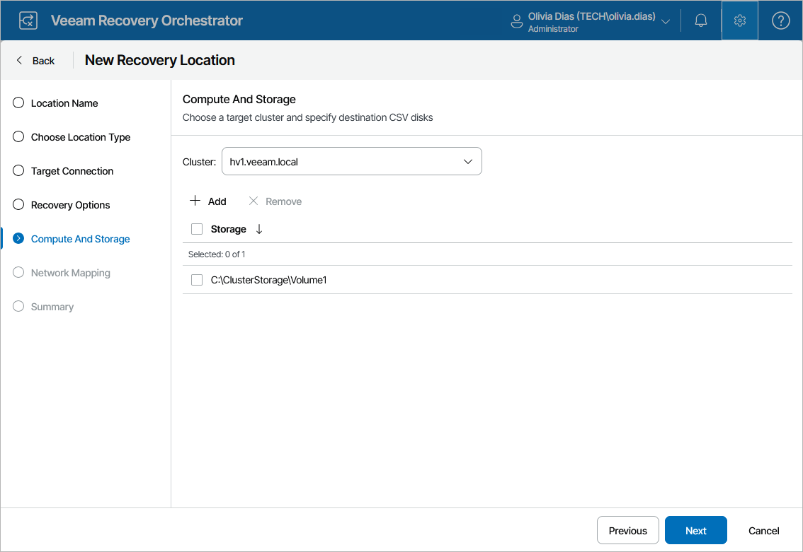

# Step 5. Specify SCVMM Server and Cluster

At the Compute and Storage step of the wizard, do the following:

1. [Applies only if you have selected the System Center Virtual Machine Manager (SCVMM) option at the [Target Connection](hyperv_location_connection.md) step of the wizard] Select an SCVMM server that will manage the process of recovering machines to a Microsoft Hyper-V environment. Note that one recovery location can be associated with one SCVMM server only.

For an SCVMM server to be displayed in the list of available servers, the SCVMM console must be installed on the machine that runs Orchestrator, and the server must be connected to Orchestrator as described in section [Connecting Microsoft Hyper-V Servers](connecting_scvmm_servers.md).

1. Select a Microsoft Hyper-V or Azure Local cluster where the recovered VMs will reside.

For a cluster to be displayed in the list of available clusters, it must be either managed by the SCVMM server selected at step 1, or added to Orchestrator as a direct connection as described in section [Connecting Microsoft Hyper-V Servers](connecting_scvmm_servers.md#cluster).

1. Click Add to specify destination CSV disks where recovered VMs will be stored.

For storage resources to be displayed in the Storage list, these resources must belong to the cluster selected at step 2.

