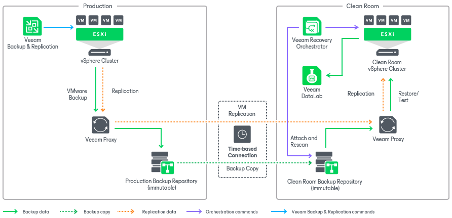

# Scenario 6: Orchestrating Restore and VM Replica Failover in Clean Room

This deployment scenario illustrates recovery to a VMware vSphere environment based on vSphere VM replicas and VM backups created by Veeam Backup & Replication in case the Veeam Backup & Replication server that protects your production workloads becomes unavailable. You can also use this scenario to recover your workloads if the production vCenter Server goes offline or if you need to temporarily disconnect Orchestrator from the network for security reasons.

In this scenario, Veeam Backup & Replication periodically copies backed-up data from the primary backup repository located in the production site to an immutable backup repository located in a remote environment (also referred to as "clean room"). If the production Veeam Backup & Replication server goes down, Orchestrator will be able to switch to the embedded Veeam Backup & Replication server to perform restore and failover.

|  |
| --- |
| Important |
| * You cannot use the clean room scenario to [test VM replicas in DataLabs](datalab_overview.md). * You can use only directly attached storage (Windows, Linux, Linux Hardened) in the clean room scenario. * You can recover VMs only from vSphere backups in the clean room scenario. Recovery of machines from Veeam agent backups is not supported.  * Sharing repositories across several Veeam Backup & Replication installations in the clean room scenario is not supported. Therefore, before connecting a repository to a new Veeam Backup & Replication server, make sure the currently connected Veeam Backup & Replication server is either permanently or temporarily offline. |

