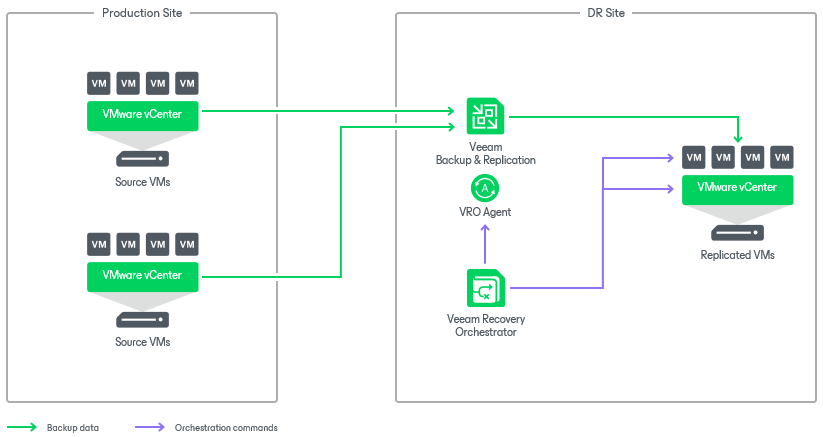

# Scenario 5: Orchestrating VM Replica Failover

This deployment scenario illustrates recovery based on vSphere VM replicas created by Veeam Backup & Replication.

In this scenario, you can switch from the original VMs in the production site to the VM replicas in the disaster recovery (DR) site. The Orchestrator server provides failover plan management, testing and execution, failing over all VMs and performing verification tests and checks to ensure successful recovery.

