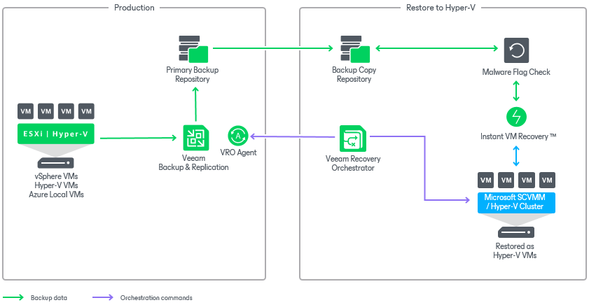

# Scenario 2: Orchestrating Restore to Microsoft Hyper-V and Azure Local (Azure Stack HCI)

This deployment scenario illustrates recovery to a Microsoft Hyper-V environment from vSphere VM backups created by Veeam Backup & Replication.

In this scenario, vSphere workloads are protected by Veeam Backup & Replication. All these workloads can be recovered to the Microsoft Hyper-V environment as virtual machines. Orchestrator can use both primary and copy backup repositories, and leverage [Veeam Instant VM Recovery](https://helpcenter.veeam.com/docs/backup/vsphere/vm_restores.html) while recovering VM backups as new Hyper-V VMs.

