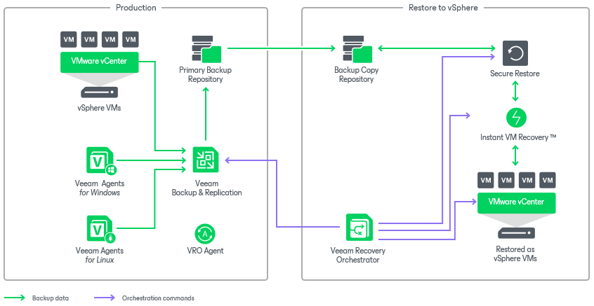

# Scenario 3: Orchestrating Restore to VMware vSphere

This deployment scenario illustrates recovery to a VMware vSphere environment from vSphere VM and Veeam agent backups created by Veeam Backup & Replication.

In this scenario, physical workloads are protected by Veeam Agent for Windows or Veeam Agent for Linux, and vSphere VM workloads are protected by Veeam Backup & Replication. All these workloads can be recovered to the VMware vSphere environment as virtual machines. Orchestrator can use both primary and copy backup repositories, and leverage both [Veeam Secure Restore](https://helpcenter.veeam.com/docs/backup/vsphere/av_scan_about.html?ver=120) and [Veeam Instant VM Recovery](https://helpcenter.veeam.com/docs/backup/vsphere/vm_restores.html?zoom_highlight=instant+vm+recovery&ver=120) while recovering agent and VM backups as new vSphere VMs.

