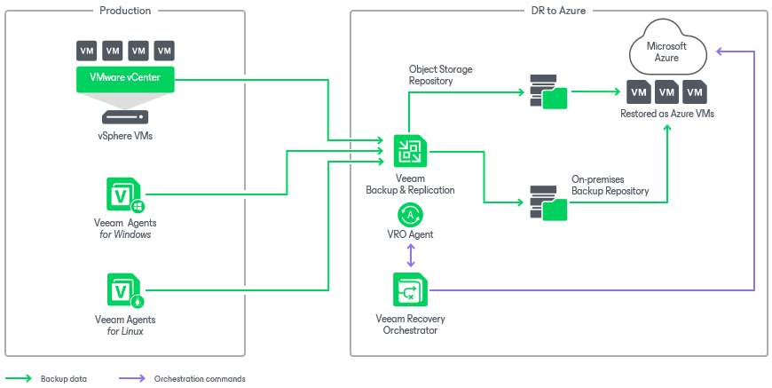

# Scenario 1: Orchestrating Restore to Microsoft Azure

This deployment scenario illustrates recovery to Microsoft Azure from both Veeam agent and vSphere VM backups created by Veeam Backup & Replication.

First, a Microsoft Azure compute account must be registered in any Veeam Backup & Replication server that is connected to Orchestrator. For more information, see the Veeam Backup & Replication User Guide, section [Microsoft Azure Compute Accounts](https://helpcenter.veeam.com/docs/vbr/userguide/restore_azure_accounts.html?ver=13).

In this scenario, physical workloads are protected by Veeam Agent for Windows or Veeam Agent for Linux, and vSphere VM workloads are protected by Veeam Backup & Replication. All these workloads can be recovered into the Microsoft Azure cloud as virtual machines. Orchestrator can use both on-premises and object storage repositories, and leverage [Veeam Secure Restore](https://helpcenter.veeam.com/docs/backup/vsphere/av_scan_about.html?ver=120) while recovering agent and vSphere backups as new Microsoft Azure VMs.

|  |
| --- |
| Note |
| If you have a PowerShell script that you want to run as part of the recovery process, you can upload your script into Orchestrator, and it will be executed when recovering machines to Microsoft Azure. |

