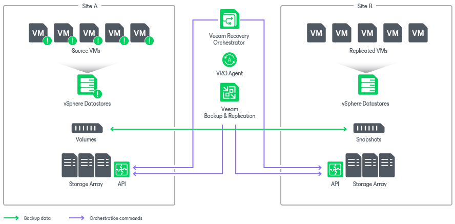

# Scenario 4: Orchestrating Storage and VM Failover

This deployment scenario illustrates recovery based on replicated storage snapshots containing vSphere VMs.

In this scenario, vSphere VMs are deployed on storage that is replicated between Site A and Site B. The Veeam Backup & Replication server triggers the creation of application-aware storage snapshots to protect the VMs. The Orchestrator server provides plan management, testing and execution, automating the failover of the storage volumes and the re-registration of VMs in the destination site.

