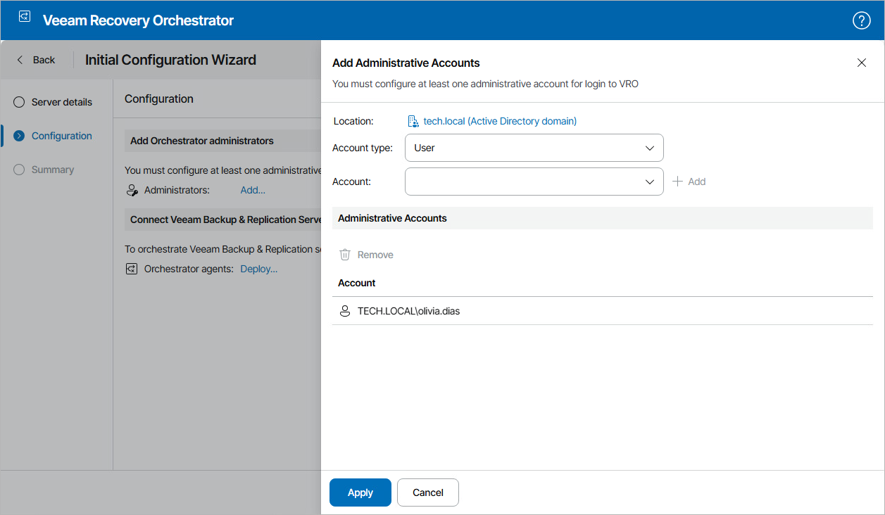
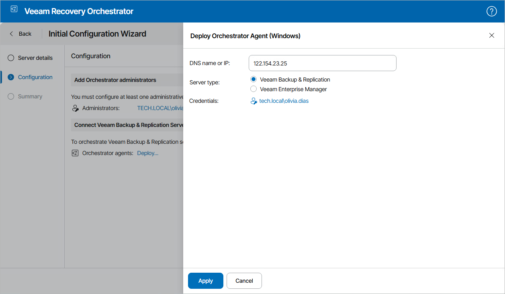

# Step 2. Configure Server Settings

At the Configuration step of the wizard, specify the Administrator account credentials and connect remote Veeam Backup & Replication servers.

Step 2a. Specify Administrator Account Credentials

In the Add Orchestrator administrators section of the Configuration step of the wizard, add users or groups of users that will be assigned the Administrator role for the server:

1. In the Administrators field, click Add.
2. In the Add Administrative Accounts window, do the following:

1. From the Account type list, select User or Group.
2. Use the Account and Location fields to enter the user or group name and to select the location to which the user or group belongs – either a domain or local OS workgroup.

For more information on the required account permissions, see [Permissions](permissions.md).

1. Click Add.
2. Repeat the procedure for each user that must become an Orchestrator Administrator and click Apply.

Step 2b. Enter Server Details

As the embedded Veeam Backup & Replication server is automatically registered in the Orchestrator UI during installation, you will not need to connect it manually.

If you want to connect a remote Veeam Backup & Replication server, use the Infrastructure > Deploy Orchestrator agent section. Alternatively, skip it and later follow the instructions provided in section [Connecting Veeam Backup & Replication Servers](connecting_backup_servers.md).

To register remote Veeam Backup & Replication servers using the Connect Veeam Backup & Replication Servers section of the Configuration step of the wizard:

1. In the Orchestrator agents field, click Deploy.
2. In the Deploy Orchestrator Agent window, click Deploy Agent and choose whether you want to deploy a Windows or Linux-based Orchestrator agent.
3. Specify whether the server is a Veeam Backup & Replication or Veeam Backup Enterprise Manager server and enter its DNS name or IPv4 address.
4. Click the Add link in the Credentials field and do the following in the Credentials window:

1. Use the User and Password fields to specify credentials of a user account for connecting to the Veeam Backup & Replication server. The provided credentials will be also used to run the Orchestrator agent on the server.
2. Click Add.
3. Repeat the procedure for each user that will be used to connect connecting to the Veeam Backup & Replication server and click Apply.

