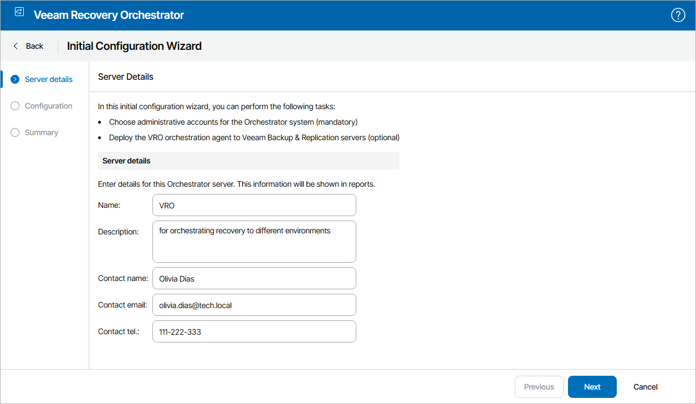

# Step 1. Launch Initial Configuration Wizard

At the Server Settings step of the wizard, specify an arbitrary name for the Orchestrator server and provide a description for future reference. To do that, click Edit. The maximum length of the server name is 128 characters; the following characters are not supported: \* : / \ ? " < > | .

You can also provide a contact name, email and telephone number of a person or a group responsible for Orchestrator.

