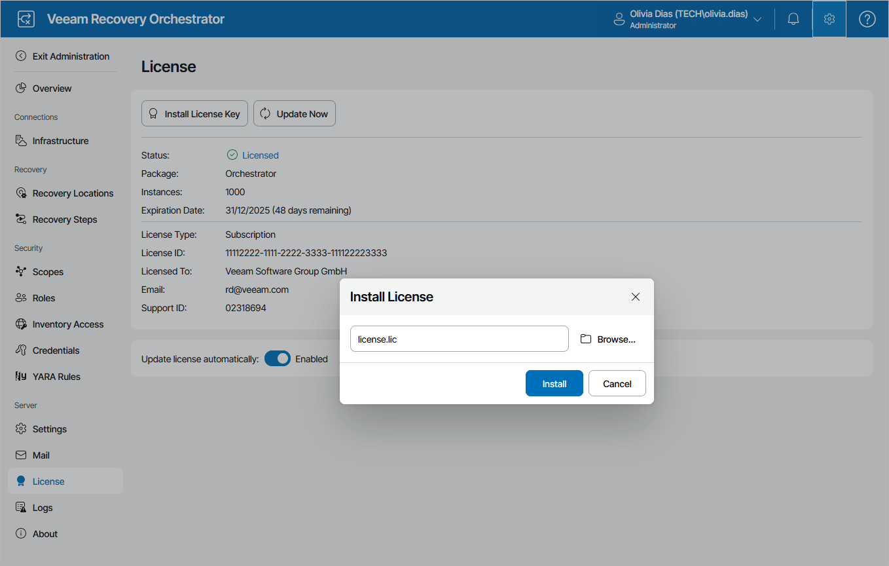

# Installing License

Before you install Orchestrator, you must specify a path to a license file. Without a license, you will not be able to start installation.

After you install Orchestrator, you can change the license that you provided during installation:

1. Switch to the Administration page.
2. Navigate to License.
3. Click Install License Key.
4. In the Install License window, click Browse to locate a license file, and then click Install.

