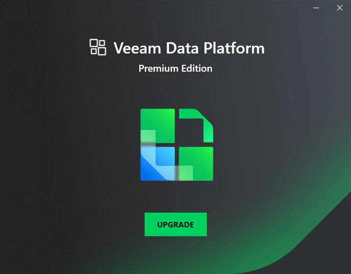

# Step 1. Launch Splash Window

To launch the splash window, perform the following steps:

1. Log in to the machine where the Veeam Orchestrator Server Service component is installed. Use an account with the local Administrator rights.
2. Insert the installation disc into the CD/DVD drive or mount the installation image. The setup will open a splash screen.
3. Click Upgrade.

|  |
| --- |
| Note |
| Before proceeding with installation, the installer will check whether you have all the necessary components installed on the machine. In case the required version is missing, the installer will offer to install it automatically. To do that, click OK.  Installation will require performing a reboot. Click Reboot in the warning message to acknowledge the reboot. |

