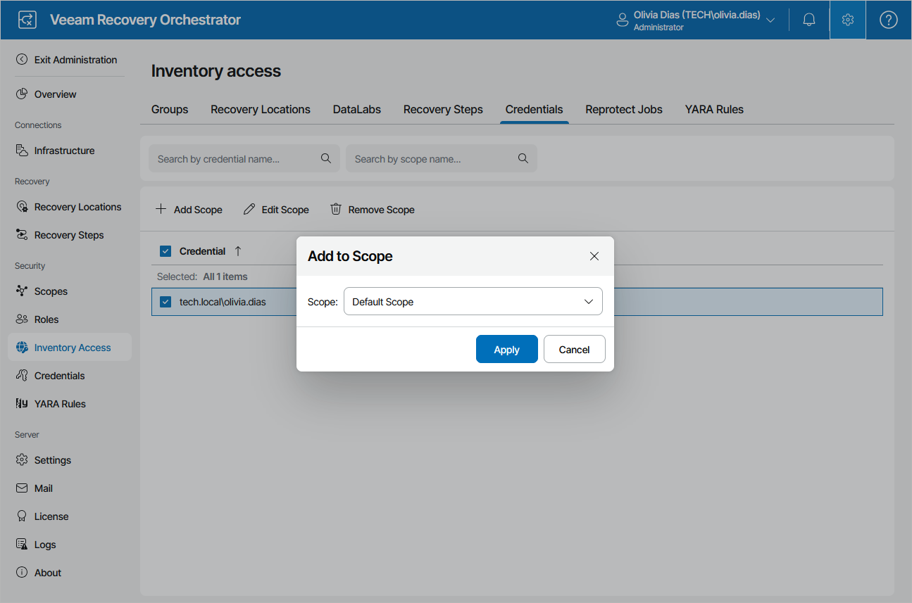

# Managing Inventory Items

Unless an item is added to the list of inventory items for a scope, it will not be available for use in the scope. By default, all items are not added to newly created scopes; only the Default Scope has all items added.

|  |
| --- |
| Tip |
| If an item is added to more than one scope, it will appear more than once in the list of inventory items — once for each scope. To view the relevant scope memberships, use the search fields displayed on the item tabs. |

To modify the list of items available for a scope:

1. Switch to the Administration page.
2. Navigate to Inventory Access.
3. Switch to the necessary tab.
4. Select an item that you want to add to the scope:

1. Click Add Scope.
2. In the Add to Scope window, select the scope from the drop-down list, and click Apply.

|  |
| --- |
| Tip |
| You can simultaneously modify the list of inventory items available for multiple scopes. To do that, select check boxes next to the required items and click Add Scope or Edit Scope. After you select a scope from the drop-down list in the Add to Scope or Edit Scope window, the changes will be applied to all the selected item at the same time. |

After you add an item to a scope, Plan Authors will be able to use this item when building recovery plans for the scope, particularly:

* Use template jobs to protect machines included in replica and restore plans.
* Use credentials when configuring the Windows Credentials and SQL Credentials parameters for plan steps.
* Use recovery locations to recover machines included in restore and cloud plans, and also when running failback.
* Use DataLabs when performing on-demand and scheduled testing of recovery plans. For more information, see [Testing Recovery Plans](testing_recovery_plans.md).

For more information on creating and editing recovery plans, see [Working with Replica Plans](working_with_replica_plans.md), [Working with CDP Replica Plans](working_with_cdp_plans.md), [Working with Restore Plans](working_with_restore_plans.md) and [Working with Cloud Plans](working_with_cloud_plans.md).

|  |
| --- |
| Note |
| By design, the list of available recovery locations will always display VMware vSphere, Microsoft Hyper-V and Microsoft Azure recovery locations only. For storage recovery locations, there is no need to allow access — Orchestrator automatically identifies the locations to be used when running storage plans. For more information on the way Orchestrator analyzes storage recovery locations, see [Storage Failover](storage_failover_overview.md). |

