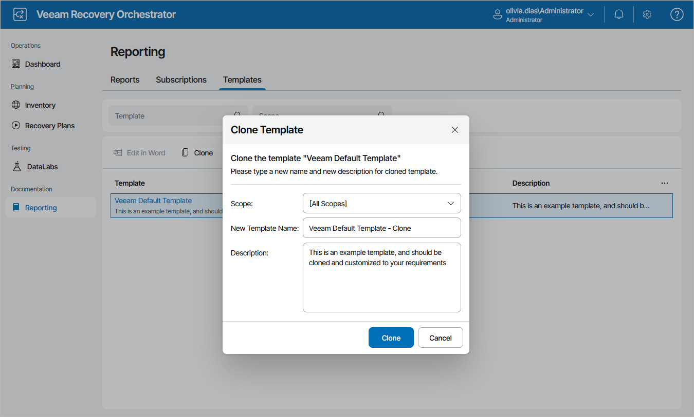

# Managing Templates

By design, you cannot customize a Veeam default template instance itself. To generate a recovery plan report based on a modified template, you must create a clone of an out-of-the-box template, edit the template using Microsoft Word integration, and then select it as the Report Template for the plan.

1. Navigate to Reporting >Templates.
2. In the Template column, select the default template and click Clone. This will create a copy of the template.
3. In the Clone Template window, enter a name and description for the new template, select a scope for which the template will be available, and click Clone.

1. Select the new template and click Edit in Word. This will launch Microsoft Word.

If you are prompted for a password, specify the credentials that you used to access the Orchestrator UI.

|  |
| --- |
| Important |
| To allow the Microsoft Word integration, Microsoft Word component of SP2 for Microsoft Office 2010 or later must be installed on the machine where the Orchestrator UI runs. |

1. Customize the default template as required and save the document. All changes will be automatically uploaded to Orchestrator.

If you want to include plan properties in the report based on the customized template, you can insert the following dynamic variables: ~Created, ~TimeZone, ~PlanType, ~PlanName, ~PlanDescription, ~PlanContactName, ~PlanContactEmail, ~PlanContactTel, ~Site, ~SiteScopeName, ~SiteDescription, ~SiteContactName, ~SiteContactEmail, ~SiteContactTel, ~ServerName, ~MachinesInPlan, ~GroupsInPlan, ~ReportType, ~TargetRTO and ~TargetRPO. To populate these variables while generating the report output, Orchestrator will use properties specified during the plan creation process.

To insert a variable:

1. Switch to the Developer tab. By default, the Microsoft Word ribbon does not show the tab. To display the tab:

1. Click File > Options.
2. In the Word Options window, switch to the Customize Ribbon tab, select the Developer check box in the Main Tabs list, and click OK.

1. Select text areas where you want to insert the variable.
2. Click the Rich Text Content Control button.
3. In the control field, enter the required variable.

|  |
| --- |
| Note |
| Orchestrator reports do not support Microsoft Word interactive elements (such as comments, footnotes and charts). If you include such elements in a template, they will not be included in the resulting report. |

1. Navigate to Recovery Plans.
2. Select the modified template as a Report Template for the plan. To do that, follow the instructions provided in section [Creating Replica Plans](replica_plan_report_template.md), [Creating CDP Replica Plans](cdp_plan_report_template.md), [Creating Restore Plans](restore_plan_report_template.md), [Creating Storage Plans](storage_plan_report_template.md) or [Creating Cloud Plans](cloud_plan_report_template.md).

