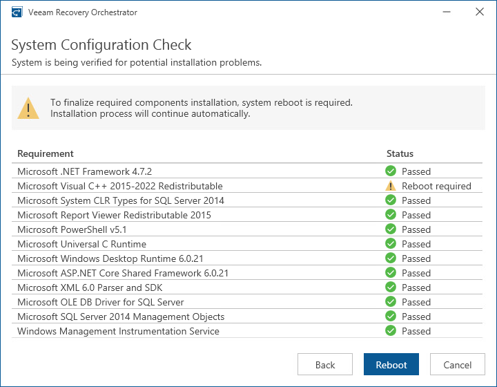

# Step 7. Perform System Configuration Check

At the System Configuration Check step of the wizard, check whether all prerequisite software is available on the target system. If some of the required software components are missing, the wizard will install missing software automatically.

|  |
| --- |
| Note |
| Installation of the missing software may require performing a reboot — to do that, click Reboot. |

