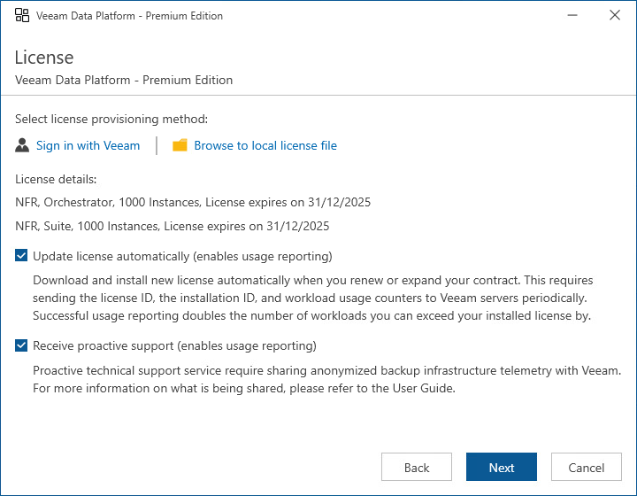

# Step 5. Provide License File

At the License step of the wizard, do either of the following:

* Browse to a local folder on your workstation to locate the license file supplied to you by Veeam. To do that, click Browse to local license file.
* Log in to your Veeam account to upload a license file from the Veeam downloads page. To do that, click Sigh in with Veeam, enter the credentials of the account and choose the necessary file from the list of available licenses.

Note that you will not be able to continue installation without providing a license.

|  |
| --- |
| Tip |
| You can instruct Orchestrator to update the license automatically and perform proactive support. If automatic license update is enabled, Orchestrator proactively communicates with the Veeam License Update Server to obtain and install a new license before the current license expires; if proactive support is enabled, Orchestrator periodically sends an anonymized file with the current Orchestrator configuration and statistical information to the Veeam Server. You can enable automatic license update and proactive support later [when configuring Orchestrator](updating_license_automatically.md). |

