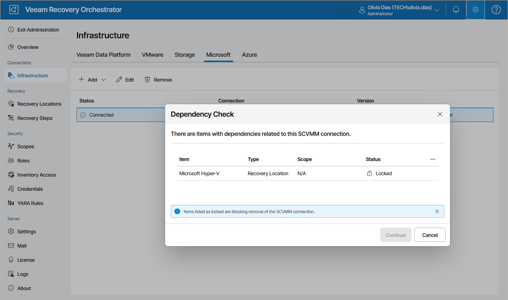

# Removing Microsoft Hyper-V Servers

If you no longer need an SCVMM server or a standalone cluster to be connected to Orchestrator, you can remove it.

1. Select the SCVMM server or cluster and click Remove.
2. The Dependency Check window will inform you if any recovery locations or recovery plans are related to the connection.

* If any of the items occur to be Locked, Orchestrator will not be able to remove the connection.

In this case, wait until Orchestrator stops processing the items, remove this SCVMM server or cluster from the locked recovery locations, reset the locked recovery plans — and then try removing the connection again.

* If none of the items are Locked, click Continue to confirm the operation.

1. Click Remove in the Remove Connection window.

|  |
| --- |
| Important |
| As soon as you remove the connection from Orchestrator, all VMs will be deleted from the related recovery plans. |

