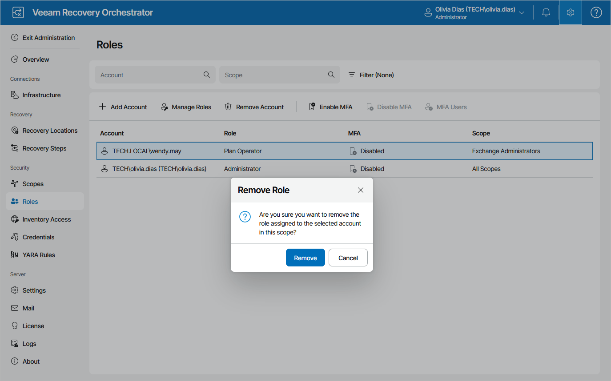

# Removing User Accounts

To remove a user account from Veeam Recovery Orchestrator, do the following:

1. Switch to the Administration page.
2. Navigate to Roles.
3. Remove each role assigned to the account. To do that, select the role and click Remove Account.

When you remove the last role assigned to the account, the account will be removed from the Orchestrator database automatically.

|  |
| --- |
| Note |
| There must always exist at least one user account with the Administrator role. This means that you cannot remove an Administrator account if you do not have any other Administrator accounts left. |

