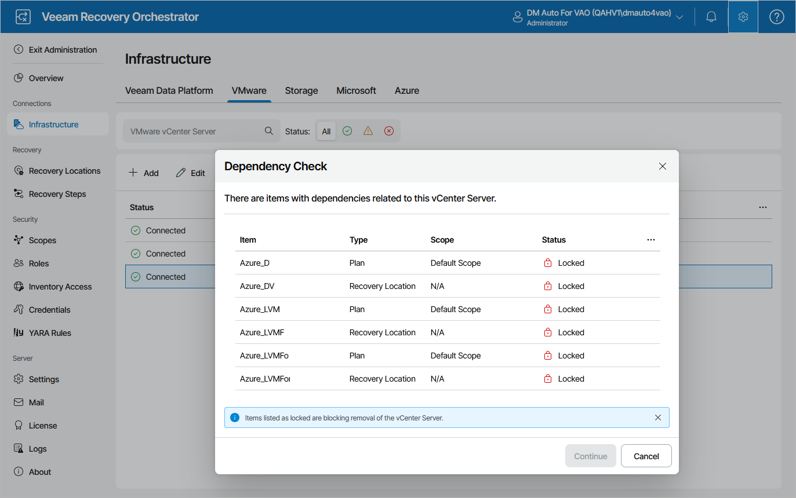

# Removing VMware vSphere Servers

If you no longer need a vCenter Server to be connected to Orchestrator, you can remove the server.

1. Select the vCenter Server and click Remove.
2. The Dependency Check window will inform you if any DataLabs or recovery plans are related to the vCenter Server.

* If any of the items occur to be Locked, Orchestrator will not be able to remove the server.

In this case, wait until Orchestrator stops processing the items, reset the locked recovery plans, power off plan testing in the locked DataLabs — and then try removing the vCenter Server again.

* If none of the items are Locked, click Continue to confirm the operation.

1. Click Yes in the Remove VMware vCenter Server window.

|  |
| --- |
| Important |
| As soon as you remove the vCenter Server from Orchestrator, all its related DataLabs will be removed from Orchestrator as well. All [inventory groups](managing_inventory_items.md) that include VMs managed by the server will be excluded from Orchestrator components, and the VMs will be deleted from the related recovery plans. |

