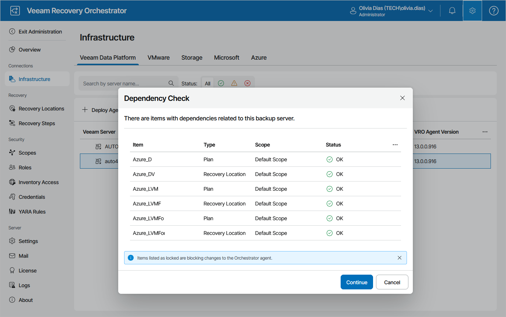
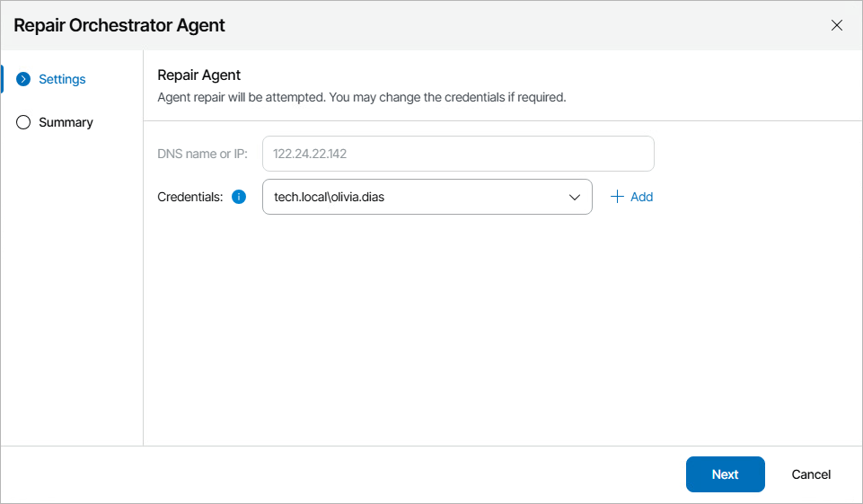
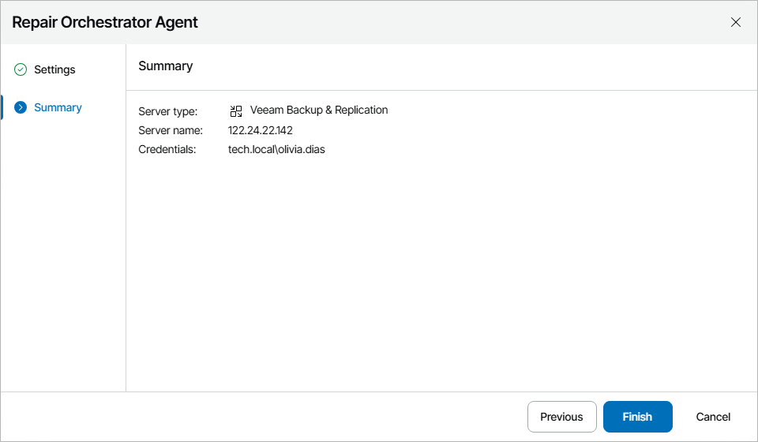

# Repairing Orchestrator Agents

If you want to change credentials of a user account that you specified when connecting a Veeam Backup & Replication server to Orchestrator, or if you encounter a connection issue and a Veeam Backup & Replication server acquires the Disconnected state, you can repair the Orchestrator agent running on the server.

|  |
| --- |
| Note |
| If you [upgrade a remote Veeam Backup & Replication server](upgrade_vbr.md) connected to Orchestrator, you must also repair the Orchestrator agent running on the server. However, it is recommended that you wait approximately 10 minutes before repairing the agent because Veeam ONE Client has to process infrastructure changes related to the upgrade. |

1. Select the Orchestrator agent and click Repair Agent.
2. The Dependency Check window will inform you if any DataLabs or recovery plans are related to the Veeam Backup & Replication server.

* If any of the items occur to be Locked, Orchestrator will not be able to repair the Orchestrator agent.

In this case, wait until Orchestrator stops processing the items, power off plan testing in the locked DataLabs, reset the locked recovery plans — and then try repairing the Orchestrator agent again.

* If none of the items are Locked, click Continue to confirm the operation.

1. Complete the Repair Orchestrator Agent wizard:

1. At the Settings step, select the necessary account from the Credentials drop-down list for connecting to the Veeam Backup & Replication server. For an account to be displayed in the Credentials list, it must be added to the configuration database as described in section [Adding Credentials](adding_credentials_manually.md). If you have not set up an account beforehand, click Add and follow the steps of the Add Credential wizard. For more information on the required account permissions, see [Permissions](permissions.md).

The provided credentials will be also used to launch the Orchestrator agent on the server. The user name must be specified in the DOMAIN\USERNAME or USERNAME format.

1. At the Summary step, review the configured settings and click Finish.

