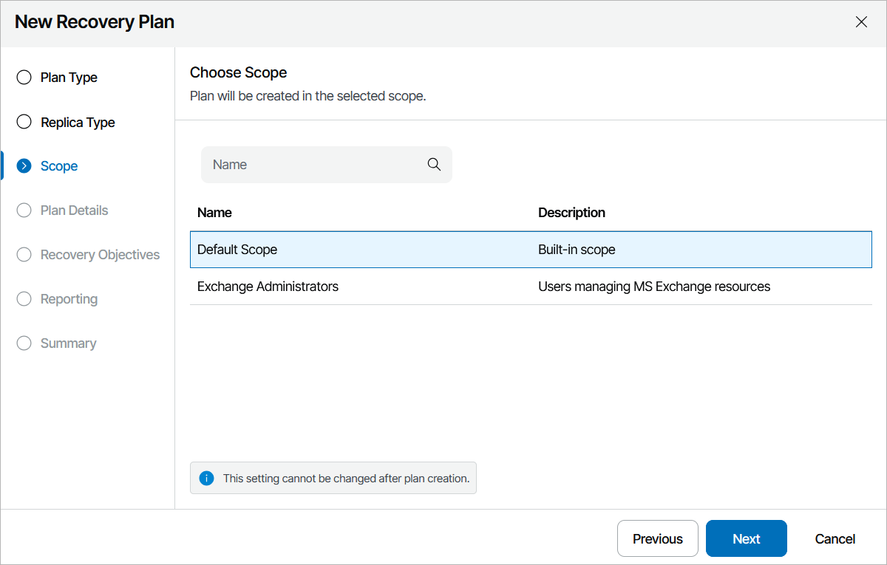

# Step 3. Choose Plan Scope

At the Scope step of the wizard, select a scope for which you want to create the plan.

For a scope to be displayed in the list, it must be created and customized as described in section [Managing Scopes](managing_scopes.md).

