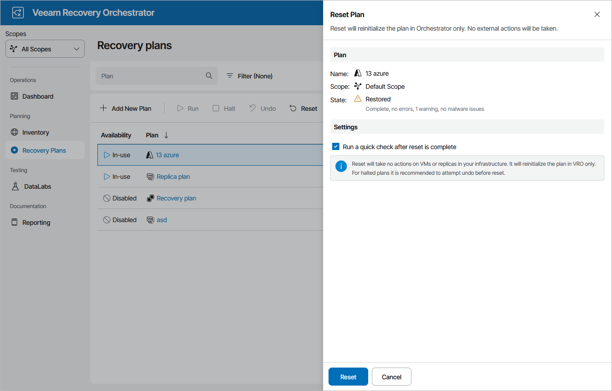

# Resetting Cloud Plans

If a cloud plan becomes inconsistent with the virtual environment, you can reset the plan. This will return the plan to the DISABLED state, without making any changes to the external virtual infrastructure.

To reset a cloud plan:

1. Navigate to Recovery Plans.
2. Select the plan and click Reset.
3. In the Reset Plan window, do the following:

1. For security purposes, retype your password and click Next.
2. Select the Run a quick check after reset is complete check box to run a [readiness check](running_readiness_check.md) after the reset.
3. Review configuration information and click Reset.

