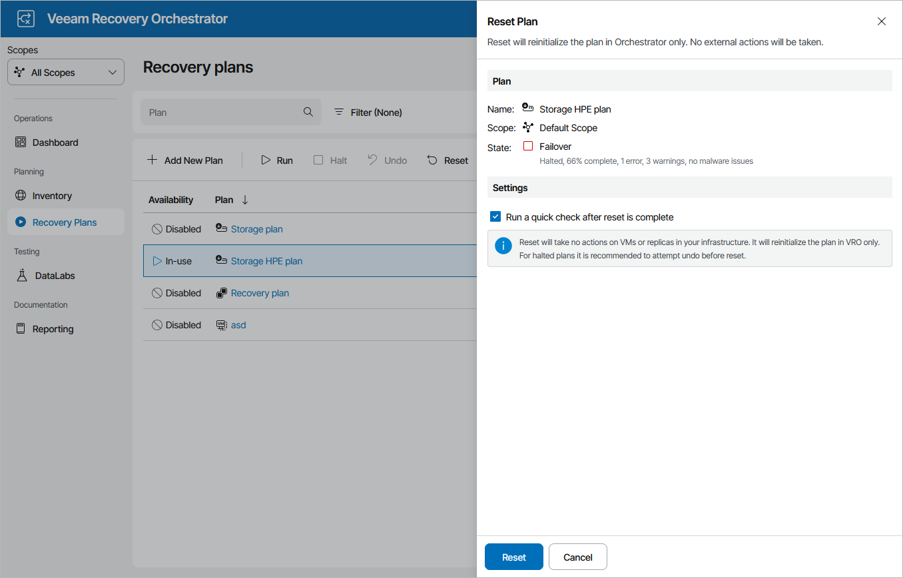

# Resetting Storage Plans

After you run a storage plan and it acquires the FAILOVER state, you must reset the plan if you wish to run it again (for example, to [perform failback](storage_failback.md)). The Reset action returns the plan to the DISABLED state and updates the Orchestrator database to reflect the changes made to the location of VMs included in the plan. The configuration of plan steps and their parameter settings in this case remain the same.

You may also require to reset a storage plan if the plan becomes inconsistent with the virtual environment. This will return the plan to the DISABLED state, without making any changes to the external virtual infrastructure.

To reset a storage plan:

1. Navigate to Recovery Plans.
2. Select the plan and click Reset.
3. In the Reset Plan window, do the following:

1. For security purposes, retype your password and click Next.
2. Select the Run a quick check after reset is complete check box to run a [readiness check](running_readiness_check.md) after the reset.
3. Review configuration information and click Reset.

