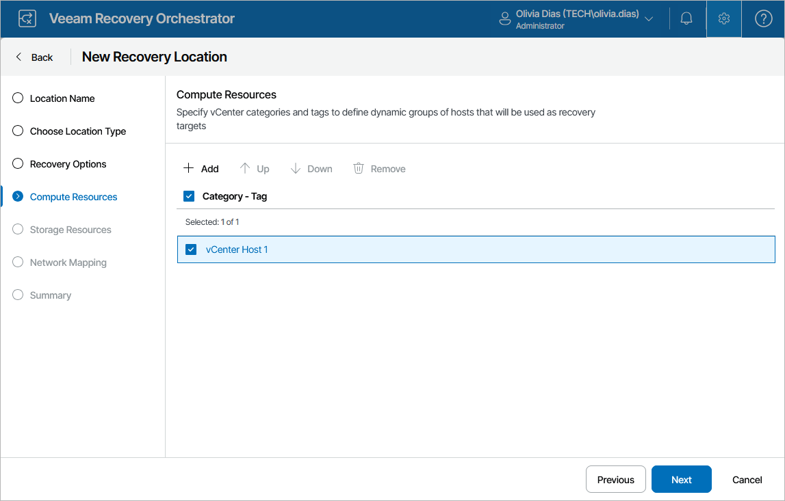

# Step 4. Specify Compute Resources

At the Compute Resources step of the wizard, specify target hosts and clusters where recovered VMs will be registered. To do that, click Add, select the required resource groups and click Save. To view hosts and clusters included in a resource group, click the group name in the Category – Tag list.

For compute resources to be displayed in the Category – Tag list, these resources must be categorized into groups in Veeam ONE Client as described in the [Veeam Recovery Orchestrator Group Management Guide](https://helpcenter.veeam.com/docs/vro/categorization/about.html?ver=13).

|  |
| --- |
| Important |
| If you add a host to a recovery location and then move the host to another datacenter, or if you move a host from one vCenter Server to another, the host will be assigned a new vCenter MoRef ID, Orchestrator will consider the host to be a new infrastructure object, and the configuration of the recovery location will become invalid. As a result, Orchestrator will not be able to use this location for restore. |

