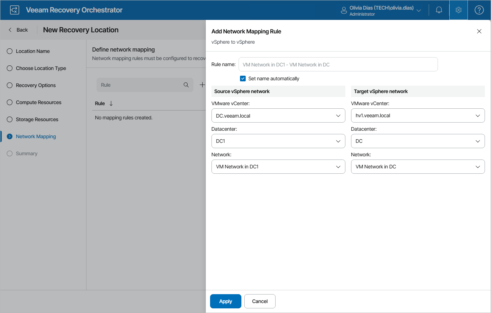
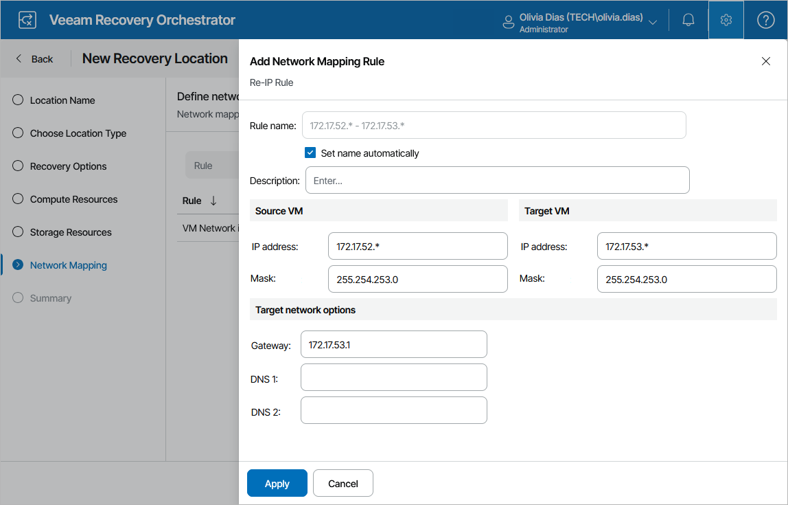

# Step 6. Configure Network Mapping

[This step applies only if you want to enable the functionality of network mapping]

When you recover a VM from a vSphere backup, the recovered VM is connected to the same vSphere networks as the source VM; if the same networks are not available in the recovery location, you can create a network mapping table for the location so that the recovered VM is connected to the correct network. However, when you recover a machine from a Veeam agent backup, there are no vSphere networks that can be used — only the IP address of the source agent is known. Therefore, to recover a Veeam agent, you must create at least one network mapping rule that maps an IP address range to a vSphere network so that the recovered VM is connected to the correct network.

To configure network mapping, click Add Mapping at the Network Mapping step of the wizard and choose whether you want to recover VMs from vSphere or Veeam agent backups. The Add Network Mapping Rule window will open.

1. Depending on whether you plan to recover machines from vSphere or Veeam agent backups, do the following in the Source network section:

* To recover VMs from vSphere backups, select a vCenter Server that manages source VMs, a network to which the source VMs are connected, and a datacenter or a cluster where the source VMs reside.

For a vCenter Server to be displayed in the vCenter Server list, it must be connected to Orchestrator as described in section [Connecting VMware vSphere Servers](connecting_vsphere_servers.md).

* To recover machines from Veeam agent backups, specify a range of IP addresses that contains the IP addresses of the source agent machines. Alternatively, create a separate network mapping rule to map each individual IP address. Note that you must specify at least one network mapping rule.

|  |
| --- |
| Note |
| Orchestrator supports IP addresses in the IPv4 format only. If a machine that you want to recover has an IPv6 address only, you must create the 0.0.0.0/0 mapping rule. Otherwise, Orchestrator may halt the recovery process. |

1. In the Target vSphere network section, select a vCenter Server that will manage recovered VMs, a network to which the recovered VMs will be connected, and a datacenter or a cluster where the target VMs will reside.

For a vCenter Server to be displayed in the vCenter Server list, it must be connected to Orchestrator as described in section [Connecting VMware vSphere Servers](connecting_vsphere_servers.md).

Configuring Re-IP Rules

[This step applies only if you want to enable the functionality of automatic IP address transformation for recovery of Microsoft Windows servers]

If the IP addressing scheme in the source location differs from the target location scheme, you can create re-IP rules for the recovery location, and Orchestrator will automatically reconfigure IP addresses of the recovered VMs. When recovering from a vSphere or agent backup, or failing back to a new location, Orchestrator checks if any of the specified re-IP rules will apply to the recovered VM: if a rule applies, Orchestrator will change the IP address configuration of the recovered VM using the Microsoft Windows registry.

|  |
| --- |
| Important |
| To allow Orchestrator to reconfigure IP addresses of a recovered VM, the machine must have VMware Tools installed. This also applies to physical servers protected by Veeam agents if you plan to recover them to the VMware vSphere environment. The readiness check for any plan containing Veeam agents will confirm the presence of VMware Tools. |

To configure a re-IP rule, click Add Mapping > Re-IP Rule. Then, do the following in the Add Network Mapping Rule window:

1. In the Description field, specify a brief outline for the rule or leave any related comments.
2. In the Source VM section, describe an IP numbering scheme adopted in the source location.
3. In the Target VM section, describe an IP numbering scheme adopted in the target location.
4. In the Target network options section, specify a default gateway that will be used for recovered VMs.

If necessary, define the DNS server addresses.

1. Click Apply.

|  |
| --- |
| Tip |
| You can use the asterisk character (\*) to specify a range of IP addresses. |

