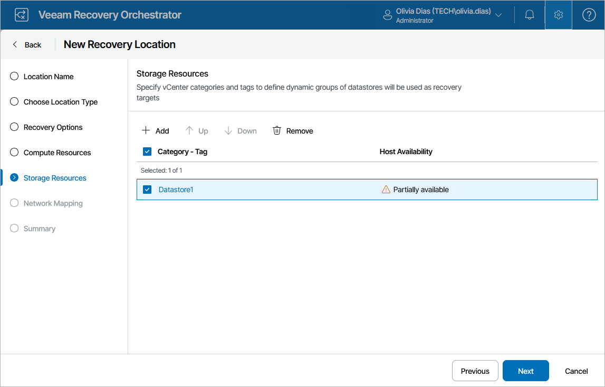

# Step 5. Specify Storage Resources

At the Storage Resources step of the wizard, specify destination datastores and datastore clusters where recovered VMs will be stored. To do that, click Add, select the required resource groups and click Save. To view resources included in a resource group, click the group name in the Category – Tag list.

For storage resources to be displayed in the Category – Tag list, these resources must be categorized into groups in Veeam ONE Client as described in the [Veeam Recovery Orchestrator Group Management Guide](https://helpcenter.veeam.com/docs/vro/categorization/about.html?ver=13).

