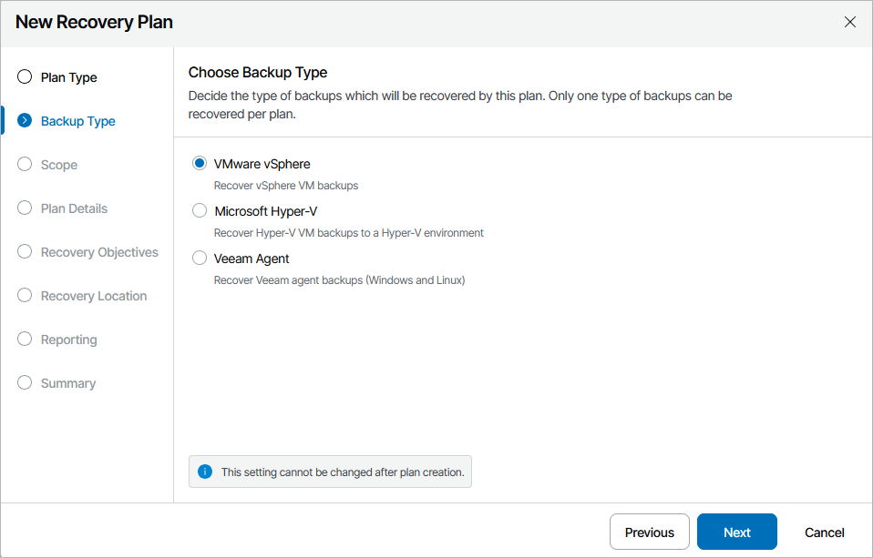

# Step 2. Choose Backup Type

At the Backup Type step of the wizard, choose whether you want to recover machines from vSphere backups, Veeam Agent backups or Hyper-V backups.

Note that one restore plan can contain inventory groups of one type only (either vSphere, Veeam Agent or Hyper-V). To recover workloads added to inventory groups of different types, create separate restore plans.

|  |
| --- |
| Important |
| For Orchestrator to be able to recover a machine to a VMware vSphere environment, the machine must have VMware Tools installed:   * For VMs recovered from Veeam agent backups, Orchestrator automatically verifies whether VMware Tools are installed on all machines included in a plan when running a readiness check or a DataLab test for the plan. However, this verification is supported for Windows-based machines only. For Linux-based machines, you must perform the verification manually. * For VMs recovered from vSphere backups, the verification is performed automatically on the vCenter Server side — for both Windows-based and Linux-based VMs. To know how to install and upgrade VMware Tools in vSphere, see [this VMware KB article](https://kb.vmware.com/s/article/2004754). |

