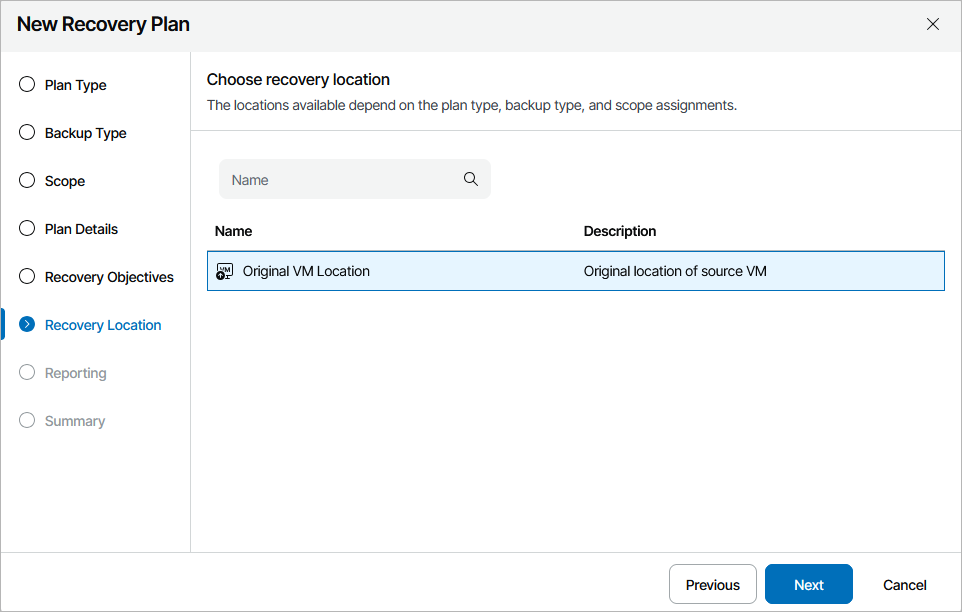

# Step 6. Select Recovery Location

At the Recovery Location step of the wizard, select a location to which inventory groups added to the plan will be restored.

For a recovery location to be displayed in the list of available recovery locations, it must be created and added to the list of inventory items available for the scope, as described in section [Managing Recovery Locations](managing_recovery_locations.md).

|  |
| --- |
| Note |
| When selecting a recovery location, you must make sure that target hosts specified when creating the location run a hardware version that is compatible with hardware versions of VMs included in the plan groups. For more information on version compatibility for vSphere VMs, see [VMware Docs](https://knowledge.broadcom.com/external/article/315655/virtual-machine-hardware-versions.html); for more information on version compatibility for Hyper-V VMs, see [Microsoft Docs](https://learn.microsoft.com/en-us/windows-server/virtualization/hyper-v/deploy/upgrade-virtual-machine-version-in-hyper-v-on-windows-or-windows-server#supported-vm-configuration-versions-for-long-term-servicing-hosts). |

