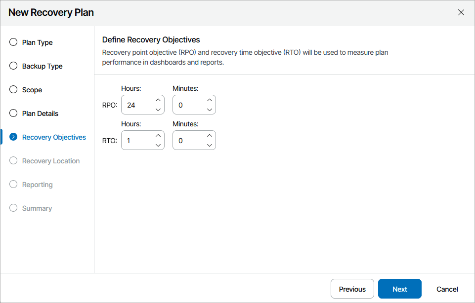

# Step 5. Specify Target RTO and RPO

At the Recovery Objectives step of the wizard, define your Recovery Time Objective (RTO) and Recovery Point Objective (RPO) for the plan:

* The RPO defines the maximum acceptable period of data loss.
* The RTO represents the amount of time it should take to recover from an incident.

|  |
| --- |
| Note |
| If you choose to perform malware scan [while running the plan](running_restore.md#ransomware_restore), Orchestrator will scan only one disk per mount server at a time. This process may take a while, affecting the plan RTO. |

RTO and RPO performance will be recorded in the [Plan Readiness Check](running_readiness_check.md), [Plan Execution](viewing_plan_execution_history.md), [Plan Audit](viewing_audit_report.md) and [DataLab Test](viewing_test_execution_history.md) reports, and you will be able to track the achieved RTO and RPO objectives for each plan on the [Home Page Dashboard](home_dashboard.md).

