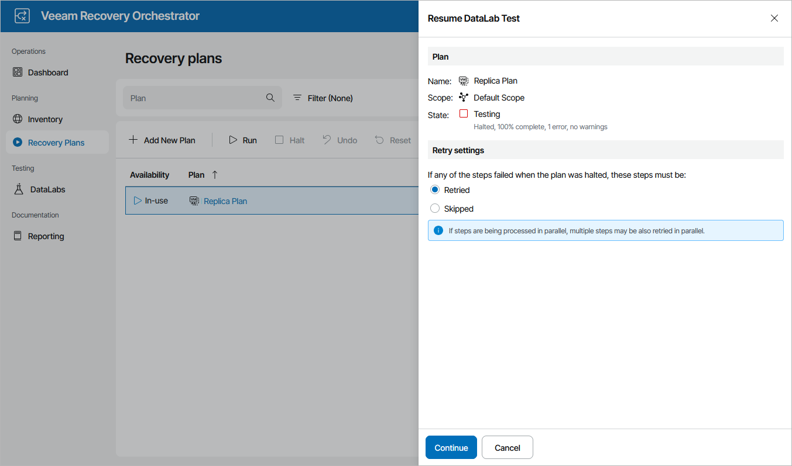

# Resuming Plan Testing

To start the HALTED plan testing process:

1. Navigate to Recovery Plans.
2. Select the plan and click Test.
3. In the Resume DataLab Test window, choose whether you want to proceed with test execution from the next plan step or to retry the failed step, and then click Continue. The testing process will be started.

