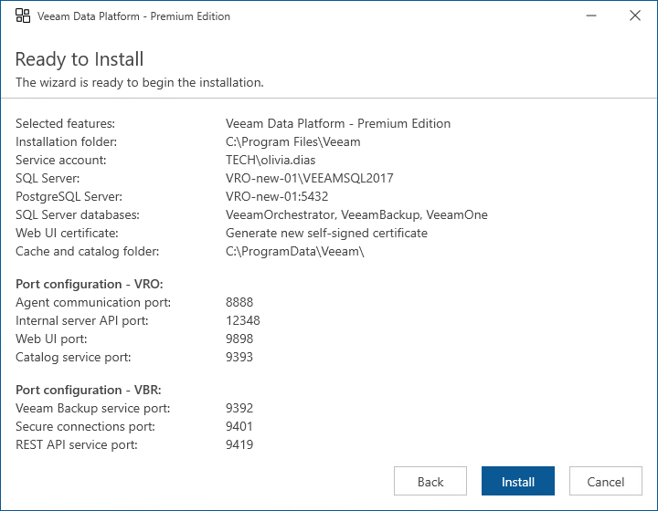

# Step 15. Review Advanced Installation Summary

[This step applies only if you have selected the Customize Settings check box at the Ready to Install step of the setup wizard]

At the Ready to Install step of the wizard, review installation configuration and start the installation process:

1. Click Install to begin installation.
2. Wait for the installation process to complete and click Finish to exit the setup wizard.

