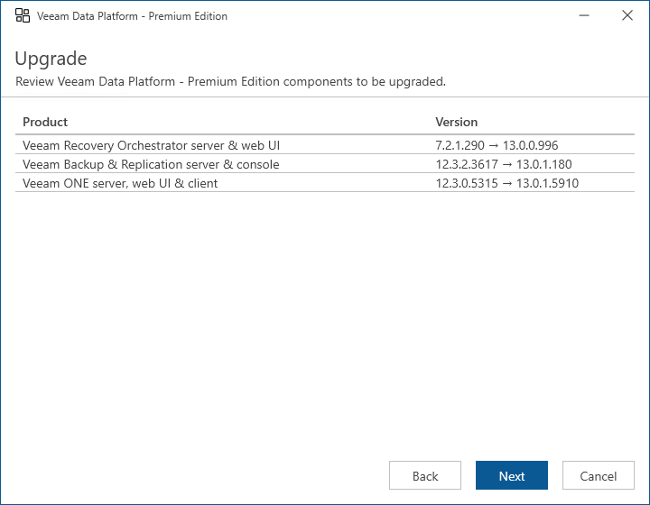

# Step 4. Review Components to Upgrade

The installer will automatically detect components of the previous version installed on the machine. At the Upgrade step of the wizard, review the components to upgrade.

