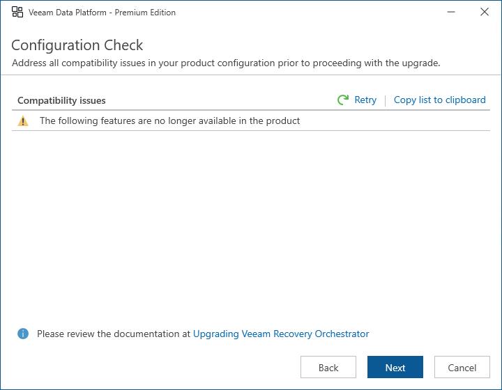

# Step 10. Review Configuration Issues

At the Configuration Check step of the wizard, check whether there are any configuration compatibility issues that may impact the upgrade. To view details on a specific issue, click the issue in the Compatibility issues list.

