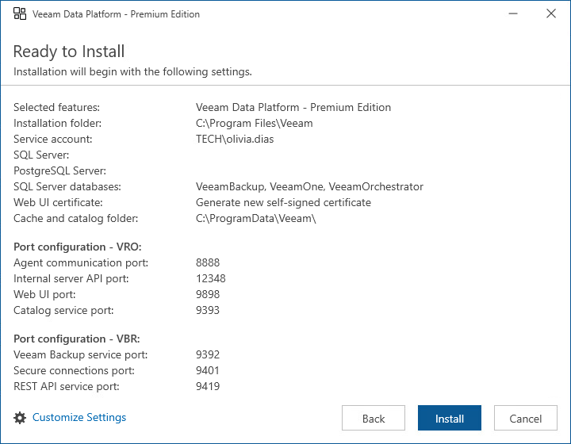

# Step 8. Review Default Installation Summary

At the Ready to Install step of the wizard, review the default installation configuration. Click Install to begin installation.

|  |
| --- |
| Note |
| If you want to use an existing local or remote Microsoft SQL Server instance, click Customize Settings. In this case, you will also be able to create Microsoft SQL Server databases, configure used ports, choose an SSL certificate to secure traffic between the Orchestrator UI and a web browser, and to select local folders where Orchestrator, Veeam ONE and Veeam Backup & Replication components will store data cache. |

