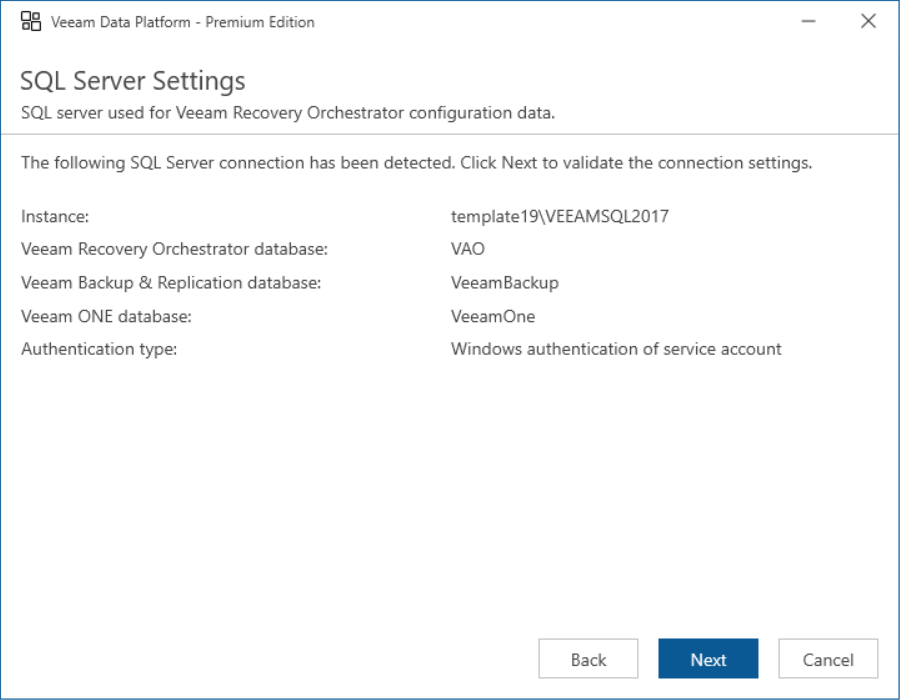

# Step 8. Review SQL Server Connection Settings

The installer will automatically detect the Microsoft SQL Server instance (installed locally or remotely) that was previously used to host the Orchestrator, Veeam Backup & Replication and Veeam ONE databases. The installer will also detect credentials for an account used by Orchestrator components to access the databases.

At the SQL Server Settings step of the wizard, review configuration information and click Next.

