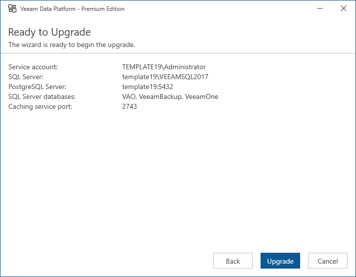

# Step 12. Begin Upgrade

At the Ready to Upgrade step of the wizard, click Upgrade to begin upgrade.

|  |
| --- |
| Note |
| When the setup wizard upgrades the Orchestrator server, the embedded Veeam Backup & Replication server and the Veeam ONE server are automatically upgraded as well. |

