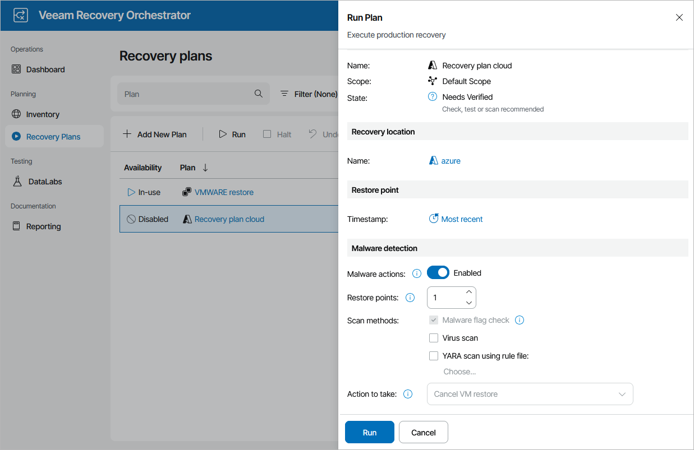

# Running Cloud Restore

The Run action causes machines in a plan to recover from their backup files. For more information on the data recovery process, see the Veeam Backup & Replication User Guide, section [Data Recovery](https://helpcenter.veeam.com/docs/vbr/userguide/data_recovery.html?ver=13).

To run a cloud plan:

1. Navigate to Recovery Plans.
2. Select the plan and click Run.
3. In the Run Plan window, do the following:

1. For security purposes, retype your password and click Next.

You must also select the Force-enable the plan check box if you have not enabled the plan yet.

1. In the Recovery location section, select a location to which inventory groups included in the plan will be restored. For a recovery location to be displayed in the list of available locations, it must be created and added to the list of inventory items available for the scope, as described in section [Managing Recovery Locations](managing_recovery_locations.md).

If the selected recovery location includes multiple proxies, Orchestrator will use the round-robin algorithm to restore machines added to the plan. For more information, see [How Orchestrator Places VMs During Cloud Restore](understanding_resource_usage_cloud.md).

1. In the Restore point section, choose a restore point that will be used to recover machines.

Keep in mind that recovering data from the archive tier is not supported. If you select the Most recent option, make sure to choose a restore point that is stored in either the capacity or the performance tier. For more information on Veeam Backup & Replication tiering options, see the Veeam Backup & Replication User Guide, section [Scale-Out Backup Repository](https://helpcenter.veeam.com/docs/vbr/userguide/backup_repository_sobr.html?ver=13).

1. In the Malware detection section, choose whether you want to check restore points created for machines included in the plan for malware flags. You can also decide whether you want to scan these restore points with antivirus software, YARA rules or both.

By default, Orchestrator checks the most recent restore point on each machine. If no clean restore point is found, Orchestrator performs the following actions depending on whether you have specified a quarantine network when configuring the cloud recovery location:

* In case you have specified a quarantine network, Orchestrator connects the machine to the network.
* In case you have not specified a quarantine network, Orchestrator halts the plan and cancels the restore operation.

For more information on how Orchestrator performs malware scan, see [Overview](malware_scan_overview.md).

1. At the Summary step, review configuration information and click Finish.

|  |
| --- |
| Tip |
| You can also scan a restore plan for possible malware without running the plan. To do that, follow the instructions provided in section [Scanning Recovery Plans](scanning_recovery_plans.md). |

The plan goal is to reach the RESTORED state. If any critical error is encountered, the plan will stop with the HALTED state. To learn how to work with HALTED cloud plans, see [Managing Halted Plans](managing_halted_cloud_plans.md).

