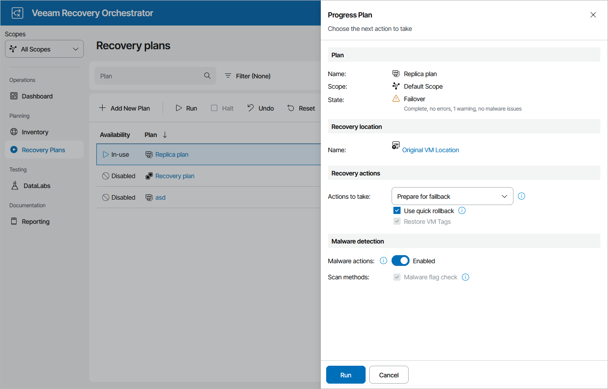

# Running Failback

To perform failback for a plan in the FAILOVER state:

1. Navigate to Recovery Plans.
2. Select the plan and click Run.
3. In the Progress Plan window, do the following:

1. For security purposes, retype your password and click Next.
2. In the Recovery Location section, select a location to which VMs will be recovered.

For a recovery location to be displayed in the list of available locations, it must be created and added to the list of inventory items available for the scope, as described in section [Managing Recovery Locations](managing_recovery_locations.md).

|  |
| --- |
| Note |
| Orchestrator will perform failback using all [settings configured for the location](configuring_recovery_locations.md) — except Instant VM Recovery and backup copy preference. These settings are not applicable to failback operations. |

If you want to fail back to a new recovery location and the selected location includes multiple hosts, datastores and networks, Orchestrator will use the round-robin algorithm to recover VMs. For more information, see [How Orchestrator Places VMs During Failback](understanding_resource_usage_failback.md).

1. In the Recovery actions section, do the following:

1. From the Actions to take drop-down list, select the Prepare to failback option for Orchestrator to switch from VM replicas to the source VMs when you run the plan next time.
2. [Applies only if you have selected the Original VM Location] Select the Use quick rollback check box if you want to instruct Orchestrator to synchronize changed data blocks only — this may help you speed up the failback process significantly.

For more information on the quick rollback process, see the Veeam Backup & Replication User Guide, section [Quick Rollback](https://helpcenter.veeam.com/docs/vbr/userguide/failback_quick_rollback.html?ver=13).

1. In the Malware detection section, choose whether you want to check restore points created for the VMs included in the plan for malware flags.

For more information on how Orchestrator performs malware scan, see [Overview](malware_scan_overview.md).

1. Review configuration information and click Run.

