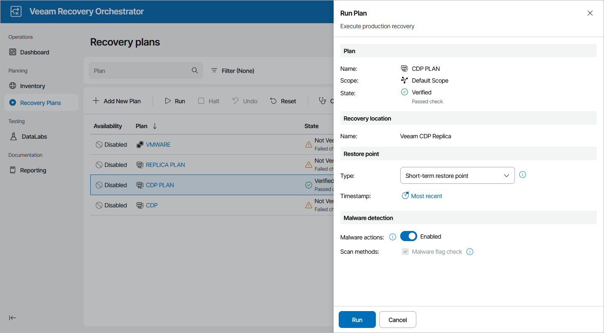

# Running Failover

The Run action causes VMs in a plan to fail over to their replicas. For more information on the failover process, see the Veeam Backup & Replication User Guide, section [Failover](https://helpcenter.veeam.com/docs/vbr/userguide/cdp_failover.html?ver=13).

To run a CDP replica plan:

1. Navigate to Recovery Plans.
2. Select the plan and click Run.
3. In the Run Plan window, do the following:

1. For security purposes, retype your password and click Next.

You must also select the Force-enable the plan check box if you have not enabled the plan yet.

1. In the Restore point section, choose whether you want to use a short-term or long-term restore point to recover VM replicas:

* Short-term restore points are replicated states that are created with the shortest RPO (several seconds or minutes) and stored according to the short-term retention settings (no longer than several hours).
* Long-term restore points are restore points that are created with a longer RPO (several hours) and stored according to the long-term retention settings (up to several days). Depending on the specified CDP policy settings, long-term restore points can be application-consistent and crash-consistent.

For more information on CDP retention policies, see the Veeam Backup & Replication User Guide, section [Creating CDP Policies](https://helpcenter.veeam.com/docs/vbr/userguide/cdp_policy_create.html?ver=13).

1. In the Timestamp field, choose a restore point that will be used to recover VM replicas.
2. In the Malware actions field, choose whether you want to check restore points created for machines included in the plan for malware flags.

For more information on how Orchestrator performs malware scan, see [Overview](malware_scan_overview.md).

1. Review configuration information and click Run.

|  |
| --- |
| Tip |
| You can also scan a restore plan for possible malware without running the plan. To do that, follow the instructions provided in section [Scanning Recovery Plans](scanning_recovery_plans.md). |

The plan goal is to reach the FAILOVER state. If any critical error is encountered, the plan will stop with the HALTED state. To learn how to work with HALTED CDP replica plans, see [Managing Halted Plans](managing_halted_cdp_plans.md).

