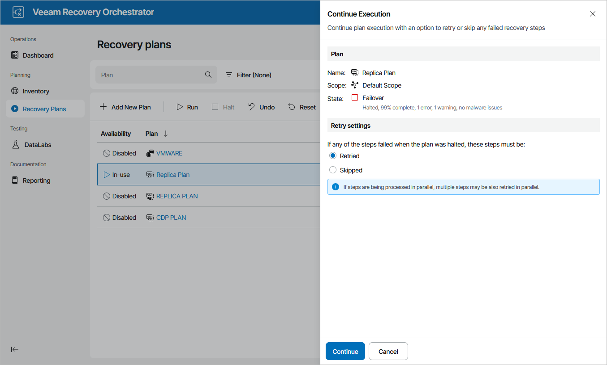

# Running Halted CDP Replica Plans

To run a HALTED CDP replica plan:

1. Navigate to Recovery Plans.
2. Select the halted plan and click Run.
3. In the Continue Execution window, do the following:

1. For security purposes, retype your password and click Next.
2. In the Retry settings section, select an option to resume plan execution.

Choose whether you want to proceed with plan execution from the next plan step or to retry the failed step.

1. Review configuration information and click Continue. The failover process will be started.

