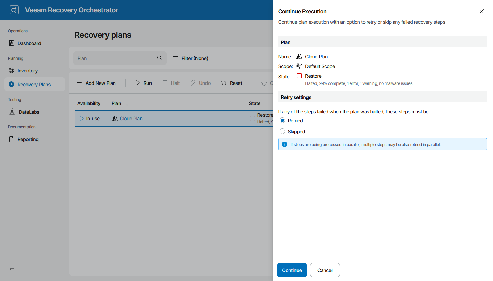

# Running Halted Cloud Plans

To run a HALTED cloud plan:

1. Navigate to Recovery Plans.
2. Select the halted plan and click Run.
3. In the Continue Execution window, do the following:

1. For security purposes, at the Credentials step, retype your password.
2. In the Retry settings step, select an option to resume plan execution.

Choose whether you want to proceed with plan execution from the next plan step or to retry the failed step.

1. Review configuration information and click Finish. The restore process will be started.

