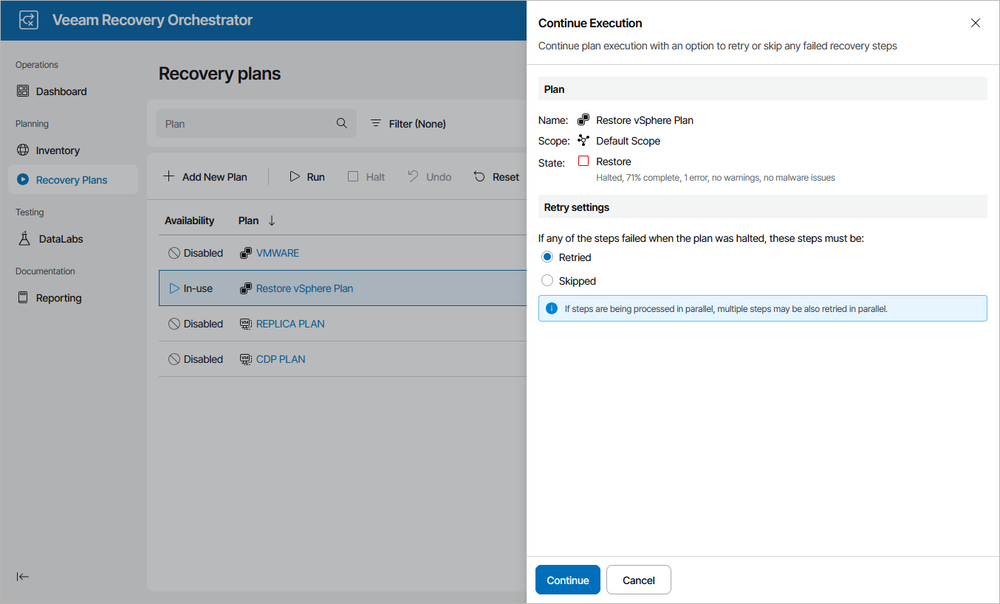

# Running Halted Restore Plans

To run a HALTED restore plan:

1. Navigate to Recovery Plans.
2. Select the halted plan and click Run.
3. In the Continue Execution window, do the following:

1. For security purposes, retype your password and click Next.
2. In the Retry settings step, select an option to resume plan execution.

Choose whether you want to proceed with plan execution from the next plan step or to retry the failed step.

1. Review configuration information and click Continue. The restore process will be started.

