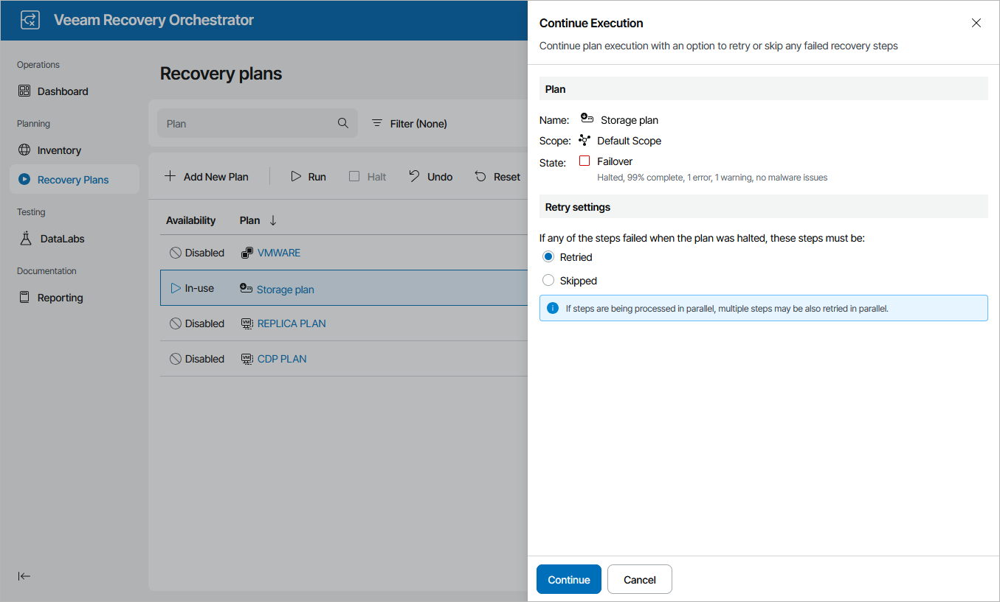

# Running Halted Storage Plans

To run a HALTED restore plan:

1. Navigate to Recovery Plans.
2. Select the halted plan and click Run.
3. In the Continue Execution window, do the following:

1. For security purposes, at the Credentials step, retype your password.
2. In the Retry settings step, select an option to resume plan execution.

Choose whether you want to proceed with plan execution from the next plan step or to retry the failed step.

|  |
| --- |
| Note |
| If you select the Retried option, Orchestrator will execute the Storage Failover step again only in case the plan halts when trying to execute the Register Replica VM (Storage) step. For more information on steps performed by Orchestrator, see [Appendix A. Recovery Plan Steps](appendix_plan_steps.md). |

1. Review configuration information and click Continue. The failover process will be started.

