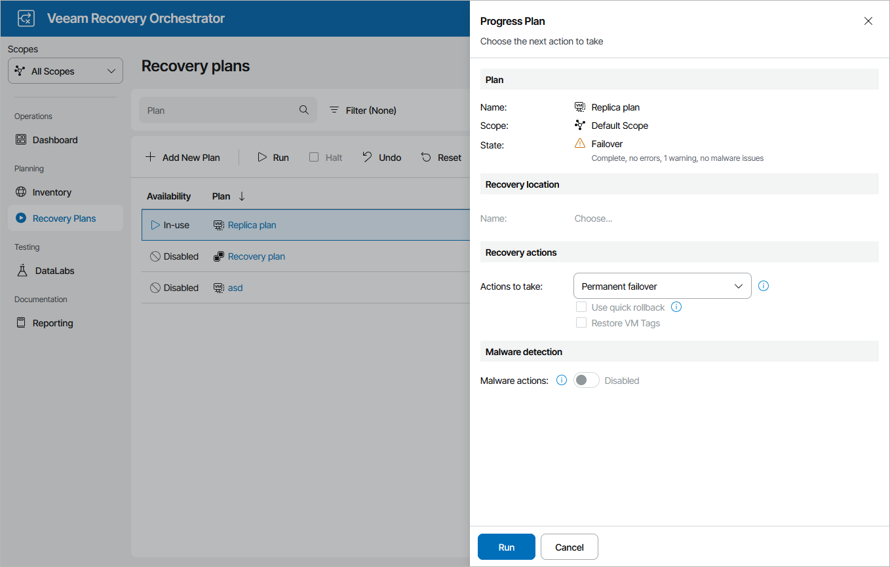

# Running Permanent Failover

To perform permanent failover for a plan in the FAILOVER state:

1. Navigate to Recovery Plans.
2. Select the plan and click Run.
3. In the Progress Plan window, do the following:

1. For security purposes, retype your password and click Next.
2. In the Recovery actions section, select the Permanent failover option.
3. Review configuration information and click Run.

|  |
| --- |
| Note |
| Failback will no longer be an option once the permanent failover process is complete. |

